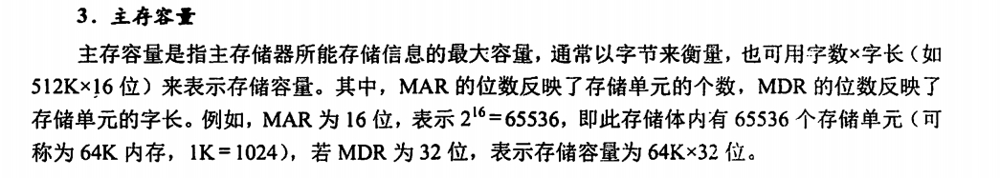
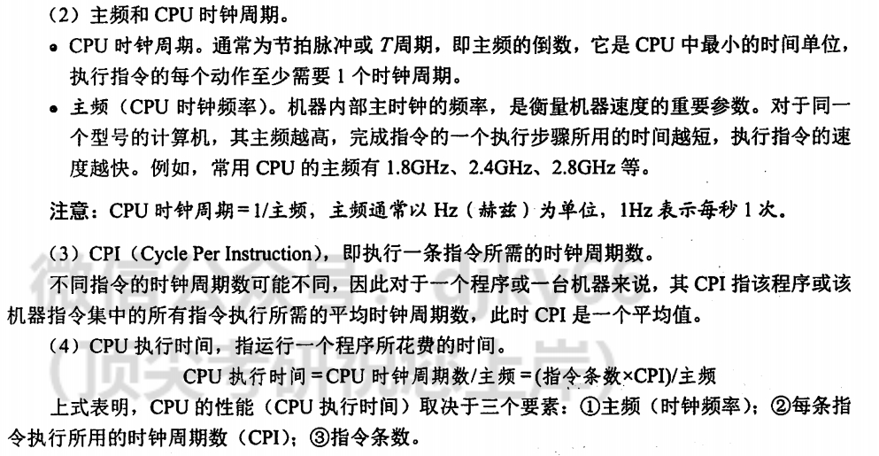
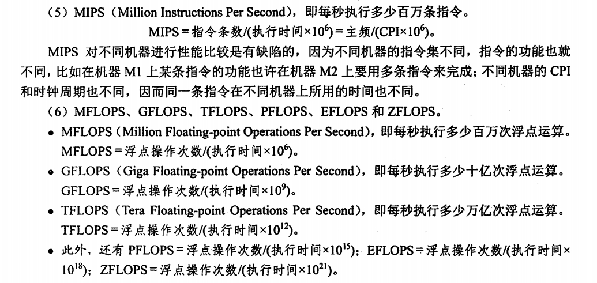

# 同志们，文物应该保存

## 计算机主要性能指标

## C语言结构体的内存排布

1. 结构体中元素按照定义顺序存放到内存中，但并不是紧密排列。从结构体存储的首地址开始 ，每一个元素存入内存中时，它都会认为内存是以自己的宽度来划分空间的，因此元素存放的位置一定会在自己大小的整数倍上开始。

2. 在原则一的基础上，检查计算出的存储单元是否为所有元素中最宽的元素长度的整数倍。若是，则结束；否则，将其补齐为它的整数倍。
