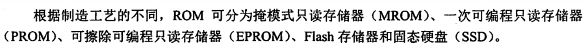

# Cool Water？

## 按存取方式分类

1. RAM 与 ROM 随机存取

2. 串行访问存储器 包括顺序存取存储器（如磁带）与直接存取存储器（如磁盘，光盘）

## SRAM

SRAM 使用的是MOS管来存储信息，同时每次读出都是非破坏性读出，原状态不需要再生。

SRAM 存储速度快，但集成度低，功耗大，价格贵，一般用于高速缓冲存储器。

> 不过好像也并不绝对，比如我现在用的 STM32 开发板就是用的 SRAM 做内存，不过考研主要默认 SRAM 是做缓存的，所以也不用过于计较。

```rust
MEMORY
{
  /*STM32F103C8T6*/
  /*RAM：20K（SRAM）*/
  /*ROM：64K（Flash）*/
  FLASH : ORIGIN = 0x8000000, LENGTH = 64K
  RAM : ORIGIN = 0x20000000, LENGTH = 20K
}
```

## DRAM

DRAM 是使用电容来存储信息，相对于 SRAM 来说，DRAM 容易集成，容量大，功耗低，但是 DRAM 的存储速度比 SRAM 的慢，一般用于大容量的主存系统。

DRAM 需要每隔一段时间就刷新一下，称为刷新周期。


DRAM 不光每个一段时间就需要刷新一下，而且每次读写之后，还需要消耗一段时间进行恢复。


## SRAM 与 DRAM


> 哎，记得除以二

## ROM



基本现在我只见过 Flash 和 SSD 。

## DRAM 级联

### 单体多字存储器

一个超长的的数组，就是咱们平时幻想中的内存条。

- 哎，理想

### 多体并行存储器

其实现在都是好几个内存条做级联的。

我的还是一个8G，一个32G QAQ

#### 高位交叉编址（顺序方式）


其实没啥用，仍然是串行读取。

> （至少在考研中）一个内存条，只要有一个字节被读写操作，整个内存条，这个硬件都要经过一个t时间的恢复时间之后才能被再次读写。

#### 低位交叉编址（交叉方式）


实际上体号是能直接看出来的，转换为二进制后直接截取最低位就是体号。

采用**低位交叉编址**之后，可以采用流水线的方式进行并行存取。

设存取周期为`T`，存取时间为`r`，为了使流水线不间断，应保证流水线的级数 `m`

$$
m >= T / r
$$

在最理想的情况下

$$
m = T / r
$$


这样存取`m`个字所需的时间为

$$
t_1 = T + (m - 1) \cdot r
$$

但并不是采用交叉编址的方式就可以彻底规避访问冲突，只有在访问的内存地址是连续的时候，流水线能够顺利进行的时候，才可以避免访问冲突导致的等待时间。

## 启示录

计算机读取数据是按照机器字对齐的方式来读取的。

流水线也是按照机器字对齐的方式来进行的。

> 哎，按页对齐，不对齐就panic

## 内存条与DRAM芯片

一个内存条是由多个DRAM芯片通过内部的级联组合而成的。


所以说`内存条`是内存条，`DRAM芯片`是DRAM芯片。

不过暂时没有看到针对内存条的知识点和考题，基本全是关于DRAM芯片的。
