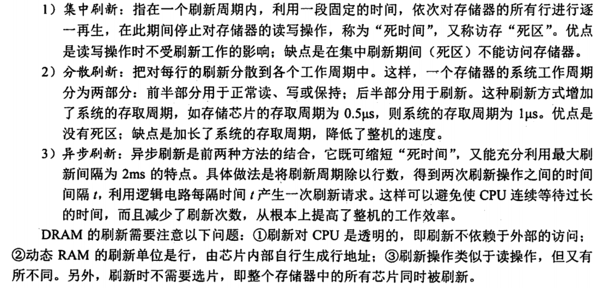
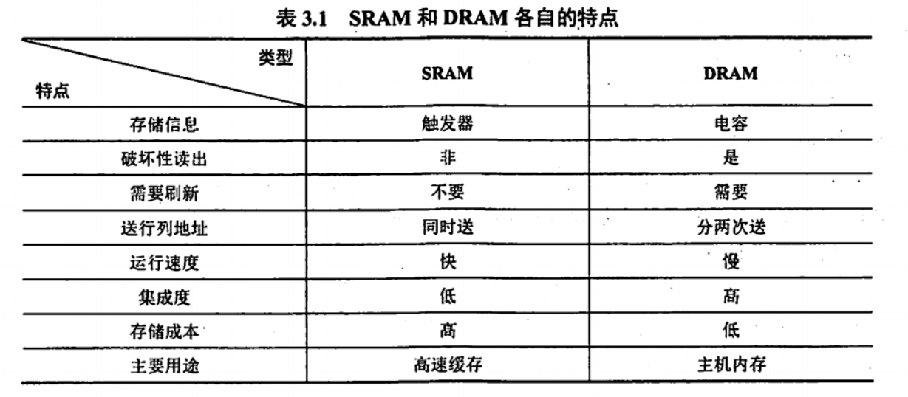
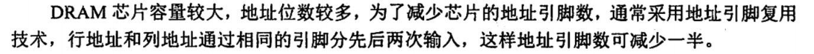
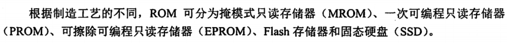

# 你来我往，谁为先手？

## 按存取方式分类

1. RAM 与 ROM 随机存取

2. 串行访问存储器 包括顺序存取存储器（如磁带）与直接存取存储器（如磁盘，光盘）

## SRAM

SRAM 使用的是MOS管来存储信息，同时每次读出都是非破坏性读出，原状态不需要再生。

SRAM 存储速度快，但集成度低，功耗大，价格贵，一般用于高速缓冲存储器。

> 不过好像也并不绝对，比如我现在用的 STM32 开发板就是用的 SRAM 做内存，不过考研主要默认 SRAM 是做缓存的，所以也不用过于计较。

```rust
MEMORY
{
  /*STM32F103C8T6*/
  /*RAM：20K（SRAM）*/
  /*ROM：64K（Flash）*/
  FLASH : ORIGIN = 0x8000000, LENGTH = 64K
  RAM : ORIGIN = 0x20000000, LENGTH = 20K
}
```

## DRAM

DRAM 是使用电容来存储信息，相对于 SRAM 来说，DRAM 容易集成，容量大，功耗低，但是 DRAM 的存储速度比 SRAM 的慢，一般用于大容量的主存系统。

DRAM 需要每隔一段时间就刷新一下，称为刷新周期。



## SRAM 与 DRAM





> 哎，记得除以二

## ROM



基本现在我只见过 Flash 和 SSD 。
