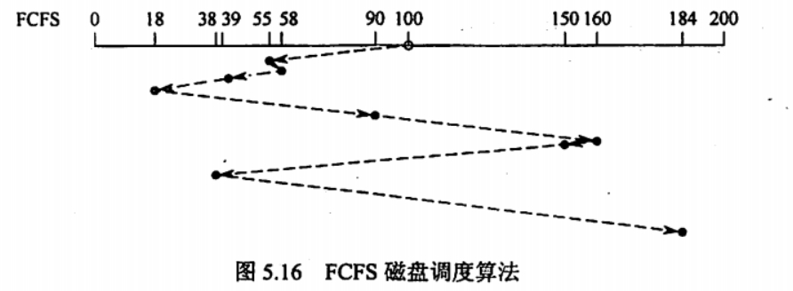

# 存得了一时，存得了一世吗？

## 磁盘

  

### 一番言いたいこと

磁盘的最小存储单位是扇区，即使是存储一个字节，也要消耗掉一个扇区。

但实际上文件系统的簇，或者是VFS的section的单位都是扇区的整数倍，所以存储一个字节，占用的扇区取决于当前文件系统的最小单位。

磁盘中的任何数据，无论是普通的数据还是标志磁盘信息的数据，都需要被调入到内存后才能被程序分析和使用。

### 磁盘的组成

1. 磁盘驱动器
2. 磁盘控制器
3. 盘片

### 存储区域

1. 柱面数
2. 盘面数(磁头数)
3. 扇区数

**而且要注意： 柱面数，盘面数，扇区数 都是从0开始计数的!!!**

### 数据传输率

磁盘存储器在单位时间内向主机传送数据的字节数，称为数据传输率，假设磁盘转数为`r`转/秒，每条磁道容量为`N`字节，则数据传输率为

$$
D_r = r \cdot N
$$

### 一次读写时间

$$
T = T_{\text{寻道时间}} + T_{\text{旋转时间}} + T_{\text{传输时间（扇区旋转时间）}}
$$

一般情况下，旋转时间取磁盘转半圈的时间。

### 减少磁盘延迟时间方法

#### 交替编号

磁盘读入一个扇区数据后需要一小段时间处理，物理上相邻的扇区会导致“延迟时间”，所以在实际上需要将磁盘扇区交替编号，使得逻辑上相邻的扇区在物理上有一定的间隔，减少读写后的延迟时间对读写速度的影响。

  

#### 磁盘地址结构的设计

采用 (柱面号，扇面号，扇区号)，来进行编址，从而在读取连续区块时，减少磁头移动的距离，加快读写速度。

注： 磁头都是如图所示，固定在一起的，每次读写，只能读取一个磁头的数据。

  

---

所以按照 **(柱面号，扇面号，扇区号)** 来编址后，当扇区号到最大值后，向扇面号进一位时，即需要读取下一个盘面的扇区上的数据时，磁头不用移动，只需旋转磁盘就可以读取数据了，相比于移动磁头，磁盘的旋转速度是快的多的。

只有当扇面号到最大值后，向柱面号进一位的时候，才需要移动磁头，切换到下一个柱面。

### 磁盘地址

但是一般情况下我们家用的磁盘只有一个驱动器，所以就没有`驱动器号`这个位段。

此时磁盘的地址格式为——

| 柱面 | 磁道 | 扇区 |
| ---- | ---- | ---- |

扇区，柱面的数值是从最外层从零开始的。

### 磁盘调度算法

#### 1. 先来先服务算法（First Come First Served, FCFS）

  

| 优点                               | 缺点             |
| ---------------------------------- | ---------------- |
| 公平，简单，而且不会发生饥饿和阻塞 | 平均寻道时间过大 |

#### 2. 最短寻找时间优先（Shortest Seek Time First, SSTF）算法

  

就是贪心算法的应用，每次寻道寻找距离当前磁道距离最近的磁道，以便使得每次的寻找时间最短。

| 优点                 | 缺点                                          |
| -------------------- | --------------------------------------------- |
| 性能比“先来先服务”好 | 不能保证平均寻道时间最短，可能出现“饥饿” 现象 |

#### 3. 扫描（SCAN）算法（又称电梯调度算法）

  

就是先往一个方向扫，直到一个端的终点，然后掉过头来继续扫。

由于磁头移动规律与电梯运行相似，因此又称电梯调度算法。

| 优点                                                                                                 | 缺点                         |
| ---------------------------------------------------------------------------------------------------- | ---------------------------- |
| 寻道性能较好，可避免“饥饿”现象(其实也不是完全能，比如磁头当前的磁道不断有请求，就会使得磁头卡在那里) | 不利于远离磁头一端的访问请求 |

#### 4. 循环扫描（Circular SCAN，C-SCAN）算法

  

在扫描算法的基础上规定磁头单向移动来提供服务，回返时直接快速移动至起始段而不服务任何请求。

| 优点                       | 缺点                                                 |
| -------------------------- | ---------------------------------------------------- |
| 消除了两端磁道请求的不公平 | 基本没有(当前的磁道不断有请求，就会使得磁头卡在那里) |

#### 5. LOOK 调度和 C-LOOK 调度

SCAN 算法和 C-SCAN 算法的改进，这两个算法中磁头总是严格地遵循从盘面的一段到另一端，显然，在实际使用时还可以改进，即磁头移动只需要到达最远端的一个请求即可返回，不需要到达磁盘端点。

  

### 文件系统在磁盘中的结构

磁盘在没有安装对应的文件系统时（例如fat32），就是一个非常普通的机械设备，甚至连自己哪个块存放了数据，哪个块是坏的都不知道，只有磁盘加上文件系统之后才能开始工作。

虽然加上了文件系统之后可以工作，但是还需要加上VFS（虚拟文件系统 inode）之后，才能被软件使用，才能被统一的系统调用所使用。

  

#### 1. 主引导记录（主引导扇区）

主引导记录（Master Boot Record, MBR），位于磁盘的0号扇区，用来引导计算机。MBR后面是分区表，改表给出每个分区的起始和结束地址，表中的一个分区被标记为活动分区，当计算机启动时，BIOS读入并执行MBR。MBR做的第一件事是确定活动分区，读入它的第一个块，即引导块。

#### 2. 引导块

引导块（boot block），MBR执行引导块中的程序后，该程序负责启动该分区中的操作系统。每个分区都从一个引导块开始，即使它不含有一个可启动的操作系统。

#### 3. 超级块（super block）（操作系统需要）

包含文件系统的所有关键信息，在计算机启动时，或者在该文件系统首次使用时，超级快都会被读入内存，超级块中的典型信息包括分区的块的数量，块的大小，空闲块的数量和指针，空闲的FCB（在Linux中就是指inode）数量和FCB指针（指示了具体某个文件的inode在哪个块中）等。

#### 4. 文件系统中空闲块的信息

可以使用位示图或指针链接的形式给出。后面也许跟的是一组inode节点，每个文件对应一个结点，inode节点说明了一个文件的方方面面。接着可能就是根目录，它存放文件系统目录树的根部，最后，磁盘的其他部分存放了其他所有的目录和文件。
