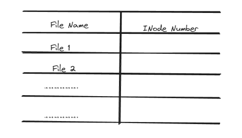

# 即使再过一千年，人们也会记得FCB

## 文件控制块（ FCB / INode ）

一个文件只对应一个 FCB（ INode ），无论这个文件有多大，INode 究其根本就是一个**胖指针**。

INode 就是一个一级索引，想要看文件的具体数据，还要看 INode 所指向的具体的盘块地址中的内容。

  

INode 在磁盘中一定是连续存放的。

## 目录

所谓目录，就是一个文件，也有专属于自己的 INode，也占据着一定数量的盘块，至于它里面的数据内容，就是一个（至少我们现在认为）Key - Value Map。

  

知道了 INode 的编号就自然知道 INode 的具体地址了，所谓数组查询就可以。

但知道了 INode 节点的具体地址也不知道文件的具体内容，还需要通过索引去看 INode 节点的具体内容，才知道文件的数据究竟在那几个簇（盘块）中。

通过 INode 编号找到 INode 在磁盘中的具体地址，然后把 INode 读入内存中，得到文件数据在磁盘中的盘块地址，然后再将文件数据从磁盘中读取到内存中，完成整个文件读操作。

## 文件的物理结构

INode 中读取到的文件数据在磁盘块的分布信息也是不一定的，取决于文件系统的具体安排，有可能获得是获得了一个盘块首地址和一个盘块长度。

此为—— 连续分配。

说白了就是—— 堆分配

这种排序使作业访问磁盘时所需要的寻道数和寻道时间最小。

增大文件长度时也和堆的策略一样，直接整体移动到一个新的地方。这也是连续分配最大的问题。

同时会增加磁盘碎片。
