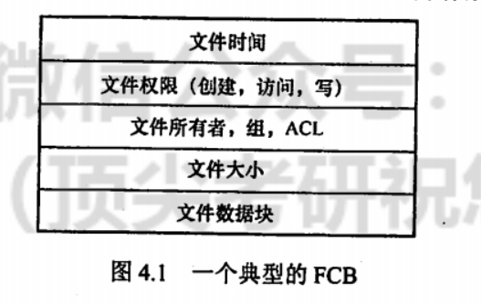

# 即使再过一千年，人们也会记得FCB

## 一番言いたいこと

在文件系统中，文件存贮的最小单位是**簇**，一个**簇**等于若干个盘块。

注意文件的最小存储单位和磁盘的最小存储单位以及内存的最小存储单位直接的区别。

INode 节点其实压根不知道自己叫啥名，它只知道它所指向的那个文件的控制信息和盘块号。

知道 INode 所指向文件叫啥名的是指向 INode 的目录项。

<div align="center">
  
</div>

## 文件控制块（ FCB / INode ）

一个文件只对应一个 FCB（ INode ），无论这个文件有多大，INode 究其根本就是一个**胖指针**。

INode 就是一个一级索引，想要看文件的具体数据，还要看 INode 所指向的具体的盘块地址中的内容。

<div align="center">
  
</div>

INode 在磁盘中一定是连续存放的。

## 目录

所谓目录，就是一个文件，也有专属于自己的 INode，也占据着一定数量的盘块，至于它里面的数据内容，就是一个（至少我们现在认为）Key - Value Map。

<div align="center">
  
</div>

知道了 INode 的编号就自然知道 INode 的具体地址了，所谓数组查询就可以。

但知道了 INode 节点的具体地址也不知道文件的具体内容，还需要通过索引去看 INode 节点的具体内容，才知道文件的数据究竟在那几个簇（盘块）中。

通过 INode 编号找到 INode 在磁盘中的具体地址，然后把 INode 读入内存中，得到文件数据在磁盘中的盘块地址，然后再将文件数据从磁盘中读取到内存中，完成整个文件读操作。

## 文件的物理结构

### 连续分配

> 其实就是堆分配

INode 中读取到的文件数据在磁盘块的分布信息也是不一定的，取决于文件系统的具体安排，有可能获得是获得了一个盘块首地址和一个盘块长度。

| 优点                                       | 缺点                                                               |
| ------------------------------------------ | ------------------------------------------------------------------ |
| 作业访问磁盘时所需要的寻道数和寻道时间最小 | 1.增大文件长度时需要直接整体移动到一个新的地方。 2. 会增加磁盘碎片 |

### 链接分配

#### 隐式链接

> 其实就是传统的链表的数据结构。

目录项中含有第一块的指针和最后一块的指针。每个盘块都含有指向文件下一个盘块的指针。

<div align="center">
  
</div>

- 缺点
  1. 只能顺序访问，随机访问效率低
  2. 稳定性低，容易导致链表中的指针丢失或损坏，导致文件系统的丢失

#### 显式链接

> 其实就是 FAT32 的管理方式

<div align="center">
  
</div>

FAT 表放在一个盘块或者簇中，在系统启动时就会被读入内存，因此查找记录的过程是在内存中进行的。

显著地提高了检索速度，而且明显减少了访问磁盘的次数。

<div align="center">
  
</div>

- 缺点
  1. FAT 表需要占用较大的内存空间。实际上，在打开某个文件时，只需将该文件对应的盘块的标号调入内存即可，完全没必要将整个 FAT 调入内存。

#### 索引分配

> 其实就是 INode 方式

现实中往往是软件层面使用的是 INode，硬盘采用的是 FAT32 或者 NTFS ，在这种情况下，操作系统通过 VFS 使得软件统一使用 INode 方式，将硬件的具体实现隔离开来。

> 所以题目里用了 INode ，就不要想着 FAT 了 :）

索引分配将每个文件所有的盘块号都集中放在一起构成**索引块（表）**

<div align="center">
  
</div>

&nbsp;

<div align="center">
  
</div>

#### 混合索引分配

> 是大杂烩吧。

<div align="center">
  
</div>

<div align="center">
  
</div>

<div align="center">
  
</div>

### 文件共享

```rust
// 破案了，软连接和硬链接不就这样吗。
use std::sync::Arc;
fn main() {
    let data = Arc::new("hello");
    let soft_link = Box::new(data);
    let hard_link = data.clone();
    assert_eq!(2, Arc::strong_count(&data));
}
```

#### 硬链接（基于索引节点的共享方式）

<div align="center">
  
</div>

注意：硬链接并没有改变 INode 节点指向磁盘空间的性质，只是增加了一个指向该 INode 节点的目录项。

<div align="center">
  
</div>

&nbsp;

<div align="center">
  
</div>

#### 软连接（符号链接）

软链接文件自己就占据了一个 INode 节点，文件内容本质上讲就是一个字符串 —— 目标文件的路径

```rust
// 理论上讲，这也算软连接文件

DATABASE_URL=sqlite://../identifier.sqlite
```

<div align="center">
  
</div>

同时可以看到，由于软连接文件只有自己一个人指向了这个存储目标文件路径的 INode，所以它的 Links 或者说索引数就是 1 。

缺点：很明显的二级查找，所以查找速度是比硬链接要慢的。

> 补充，如果程序中打开文件使用的链接是软连接文件，那么在进程中看到打开文件是该软链接所指向的文件。

```rust
use tokio::{fs::File, io::AsyncWriteExt};
#[tokio::main]
async fn main() -> anyhow::Result<()> {
    // c.txt -> a.txt
    let mut f = File::options().append(true).open("./c.txt").await?;
    tokio::time::sleep(tokio::time::Duration::from_secs_f32(200.0)).await;
    f.write_all(b"new line\n").await?;
    Ok(())
}
```

<div align="center">
  
</div>

<div align="center">
  
</div>
