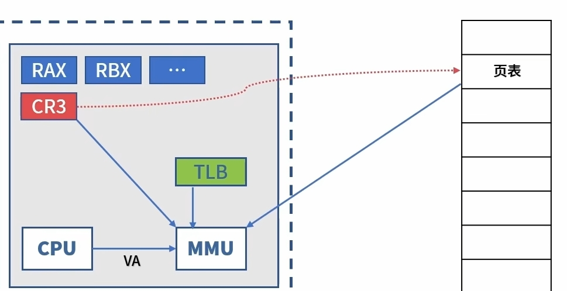
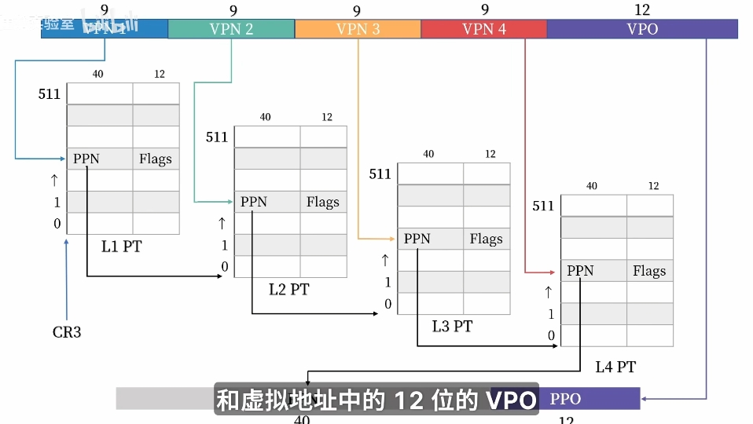
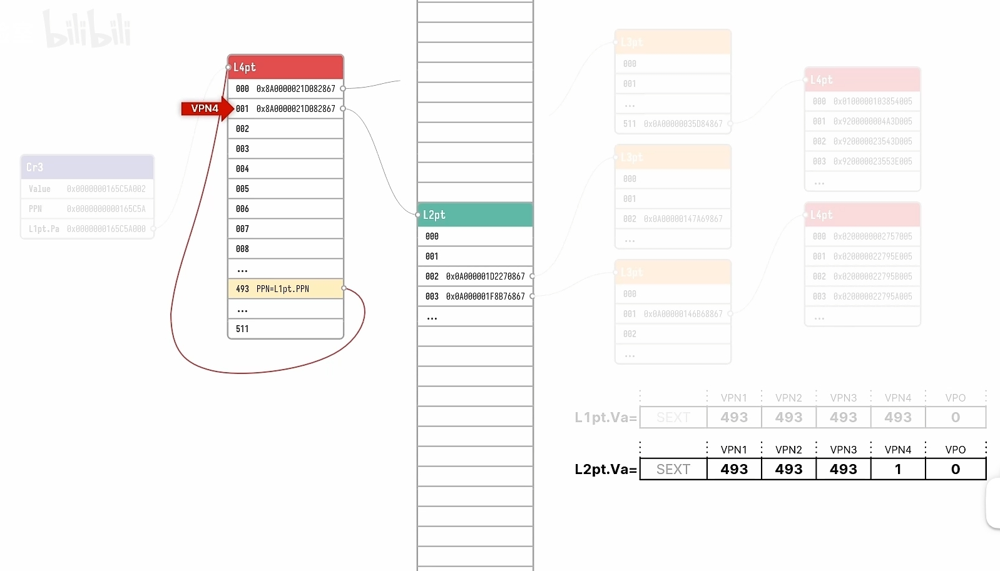
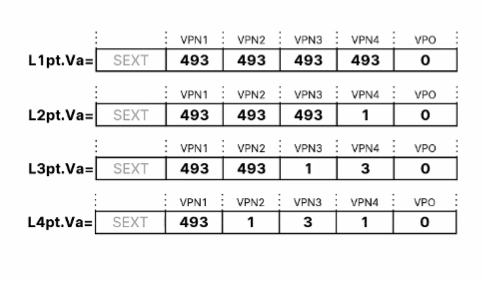
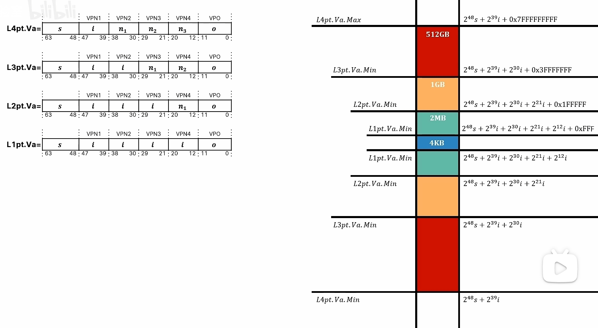
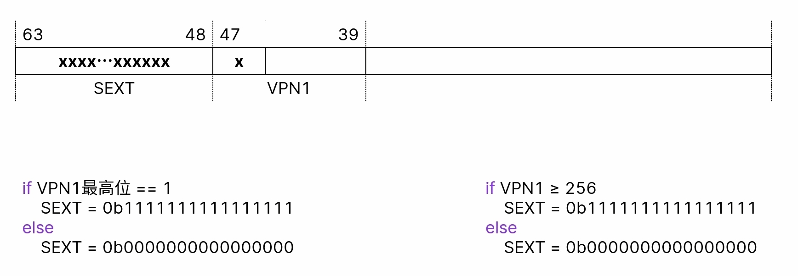
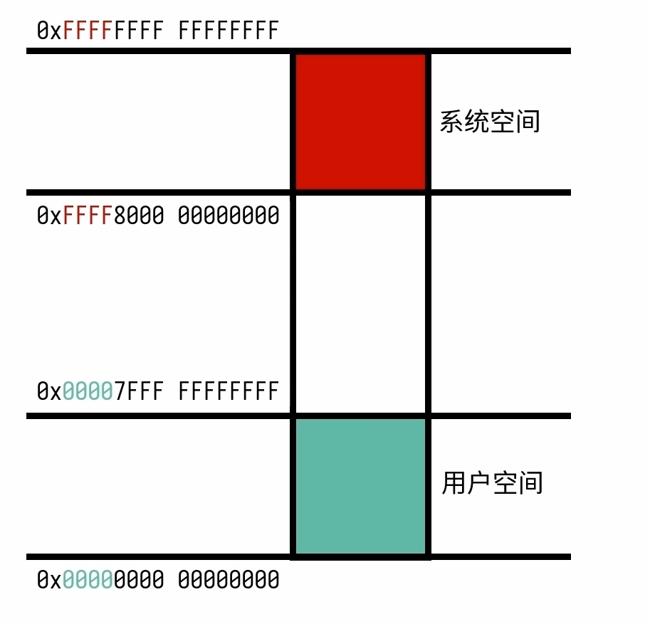
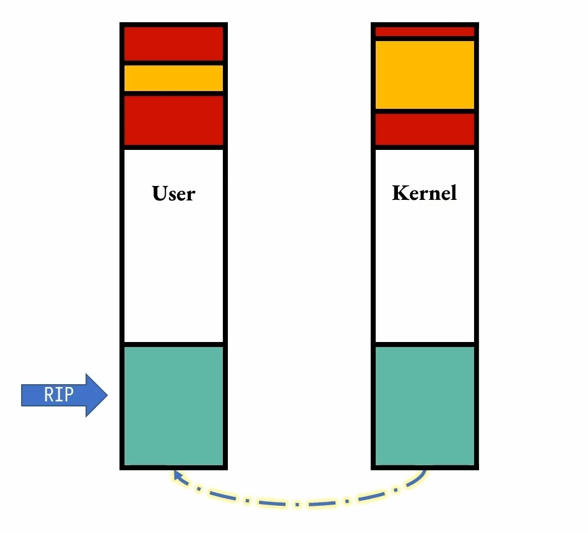

# 一切安全的历史，都是地址的历史

## MMU 与 CR3 与 CRX

<div align="center">
  
</div>

MMU 负责查询 TLB 快表， CR3 负责记录当前进程的一级页表的物理地址。

还有其他的 CRX 标记着其他关于虚拟地址转换的控制位。

> 不要以为就这么完了。

## AMD64 位下的地址转换规则

<div align="center">
  
</div>

实际上每个在 AMD64 下的虚拟地址有效部分只有 48 位，现实中计算机能调动的最大物理地址为 52 位。

而之所以能做到这一点，靠的就是每个页表项压根没完全使用 64 位作为下一级页表的物理地址，而是分成了 40 位页表号和 12 位 Flags 控制位。

最后在 L4 PT 中获得的 40 位页框号和 12 位页内偏移组合成 52 位物理地址。

### 在页表

一个页表项可能最后导向的是一个 4KB 的页， 也有可能是 4MB 的页， 也有可能是 1GB 的大页。

这其中的区别不过是 $4 \times 9 + 12$ 和 $3 \times 9 + 12$ 和 $2 \times 9 + 12$ 的区别罢了。

不过页目录肯定都是 4KB 大小的。

毕竟每个页目录中能表项的数量只能是 $2^9$

```c
typedef union _PA
{
    UINT64 Value;
    LARGE_INTEGER AsLargeInteger;
    struct
    {
        UINT64 PPO : 12;
        UINT64 PPN : 40;
        UINT64 Reserved1 : 12;
    } Fields4KB;
    struct
    {
        UINT64 PPO : 21;
        UINT64 PPN : 31;
        UINT64 Reserved1 : 12;
    } Fields2MB;
    struct
    {
        UINT64 PPO : 30;
        UINT64 PPN : 22;
        UINT64 Reserved1 : 12;
    } Fields1GB;
} PA, *PPA;
```

```c
typedef union _L2PTE
{
    UINT64 Value;
    struct
    {
        UINT64 P : 1; // present 表明该页是否存在
        UINT64 R_W : 1;
        UINT64 U_S : 1; // 哎，U_S 位
        UINT64 PWT : 1;
        UINT64 PCD : 1;
        UINT64 A : 1;
        UINT64 D : 1;
        UINT64 PS : 1; // Page Size 为 1 表明这个页表项指示的是一个 1 GB 大小的页
        UINT64 G : 1;
        UINT64 Ignored1 : 2;
        UINT64 R : 1;
        UINT64 PAT : 1;
        UINT64 Reserved1 : 17;
        UINT64 PPN : 22;
        UINT64 Ignored2 : 7;
        UINT64 ProtKey : 4;
        UINT64 XD : 1;
    } Fields1GB;
    struct
    {
        UINT64 P : 1;
        UINT64 R_W : 1;
        UINT64 U_S : 1;
        UINT64 PWT : 1;
        UINT64 PCD : 1;
        UINT64 A : 1;
        UINT64 Ignored1 : 1;
        UINT64 PS : 1;
        UINT64 Ignored2 : 3;
        UINT64 R : 1;
        UINT64 PPN : 40;
        UINT64 Ignored3 : 11;
        UINT64 XD : 1;
    } Fields;
} L2PTE, * PL2PTE;
```

```c
typedef union _L3PTE
{
    UINT64 Value;
    struct
    {
        UINT64 P : 1;
        UINT64 R_W : 1;
        UINT64 U_S : 1;
        UINT64 PWT : 1;
        UINT64 PCD : 1;
        UINT64 A : 1;
        UINT64 D : 1;
        UINT64 PS : 1;
        UINT64 G : 1;
        UINT64 Ignored1 : 2;
        UINT64 R : 1;
        UINT64 PAT : 1;
        UINT64 Reserved1 : 8;
        UINT64 PPN : 31;
        UINT64 Ignored2 : 7;
        UINT64 ProtKey : 4;
        UINT64 XD : 1;
    } Fields2MB;
    struct
    {
        UINT64 P : 1;
        UINT64 R_W : 1;
        UINT64 U_S : 1;
        UINT64 PWT : 1;
        UINT64 PCD : 1;
        UINT64 A : 1;
        UINT64 Ingored1 : 1;
        UINT64 PS : 1;
        UINT64 Ignored2 : 3;
        UINT64 R : 1;
        UINT64 PPN : 40;
        UINT64 Ignored3 : 11;
        UINT64 XD : 1;
    } Fields;
} L3PTE, * PL3PTE;
```

## 自映射(Windows 特供)

在 Windows 中页表如何知道自己的物理地址捏 ~

<div align="center">
  
</div>

就是通过这种绕大圈的方式巧妙的使得可以获得页表自己的物理地址。

<div align="center">
  
</div>

<br/>

493 的这个自映射条目是每次开机之后随机写在相应控制寄存器的。

## 页表在内存中的分布(Windows 特供版)

<div align="center">
  
</div>

总而言之，页表被存放在了一个物理地址范围为 512G 的区域中，而且 s 作为符号拓展位，实际上都是依靠 i 来控制着各个页表具体的位置。

## 地址的符号拓展位(AMD64 特供版)

<div align="center">
  
</div>

<br/>

这样就导致了虚拟地址空间是这样分布的。

<br/>

<div align="center">
  
</div>

<br/>

> 好了，终于破案了。

这样做的优势是当虚拟地址由 48 位扩展到 57 位，支持五级页表之后，系统空间和地址空间会一起向中间扩展，过去的地址仍然可用，保证了兼容性。

## KVA Shadow (Windows 特供版)

<div align="center">
  
</div>

<br/>

说白了就是影子页表，一个进程有两套页表。

<div align="center">
  
</div>

系统维护着两套一级页表，当发生系统调用时，程序会先进入用户下的内核跳板，然后在跳板代码的作用下进入内核页表，完成系统调用代码，然后再通过跳板代码，回到用户模式。

用户页表只映射了很少部分的内核代码，内核页表和用户页表映射了同一套跳板代码。

同时每个页表条目新加了一个控制位 —— **XD**

KVA Shadow 利用这个实现了软件的 **SMEP**(Software Supervisor Mode Execution Prevention ) 功能。
