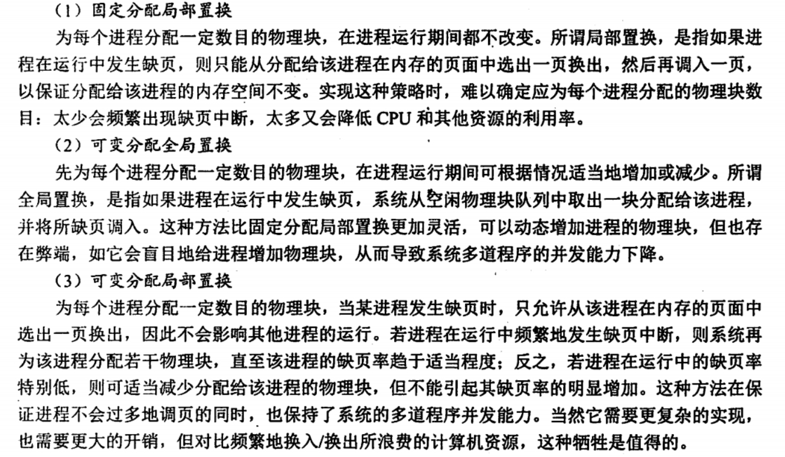
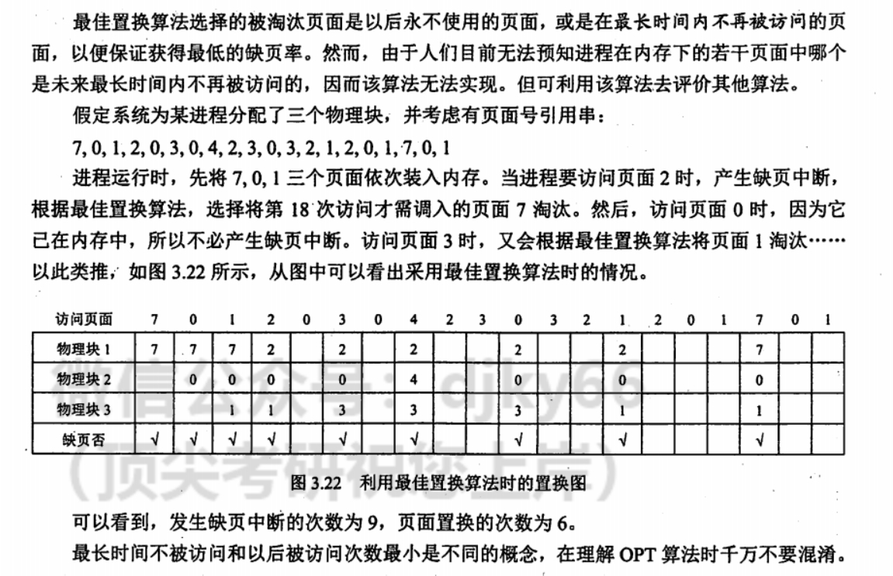
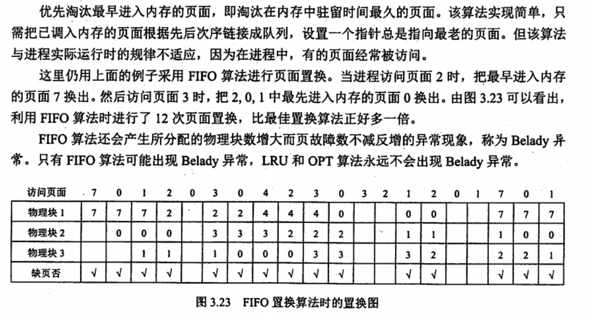
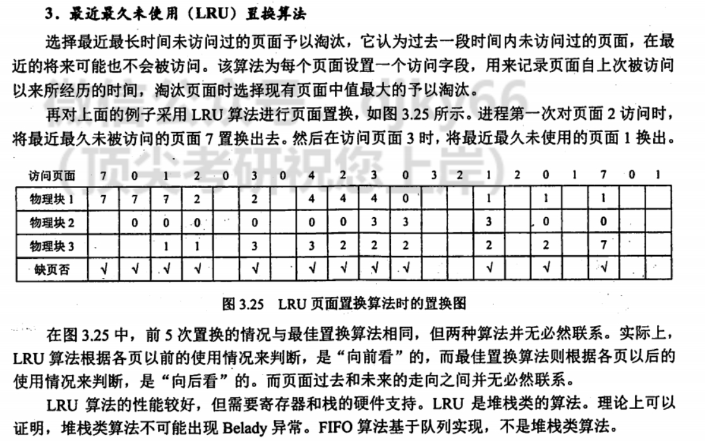
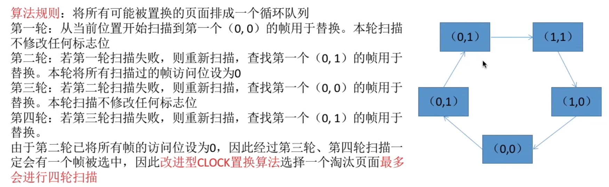

# 让我们来建设真正的地址吧

## 分段式内存

> 老东西快进棺材里吧

就是 AMD64 下的 CS 与 IP

CS 存储的为段选择子，即为**段号**，CS 的缓存中存储的是段表中对应段号的 段起始地址，段长度，段控制位等。

在分段式内存的情况下

$$
\text{物理地址} = \text{段起始地址} + \text{IP}
$$

当然，在访问之前，需要检查一下是否超过了**IP**的值是否超过了段长度，如果超过了，就会触发中断。

  

## 段页式管理

在段页式系统中，作业的逻辑地址分为三部分：段号，页号和页内偏移地址。

  

 

- 注意：在一个进程中，段表只有一个，而页表可能有多个。

## 分段式内存下的内存分配

  

 

  

 

  

 

所以总结为：还是首次适应算法好啊。

## 一期总结

为什么要使用分页？

因为要解决内存碎片问题。提高内存的利用率。

## 局部性原理

1. 时间局部性
2. 空间局部性

## TLB （快表）

其实就是页目录项的**cache**，一般在访问页目录之前会先查看一下 TLB，如果访问成功的话，就直接按照 TLB 的内容直接访问物理内存。

### 快表（TLB）访问流程

## 驻留级与工作集

驻留级：指请求分页存储管理中给进程分配的内存块的集合。

工作集：指在某段时间间隔里，进程实际访问页面的集合。

  

## 内存分配策略

### 固定分配与可变分配

固定分配：一个进程分配的页的数量是固定的，永远都会有这么几个。

可变分配：一个进程分配的页的数量是不固定的，是看情况的，如果一个进程在一段时间内总是发生缺页，就多分配几个，如果在一段时间内用的页少，就少分配几个，或者看系统当前运行的进程数量来决定每个进程能分配的页面数量。

### 局部置换与全局置换

局部置换：如果一个进程发生了缺页，从自己分配的页中进行调度。

> 经典剪刀差✂

全局置换：如果一个进程发生了缺页，就从别的进程中分配的页中去调度。

> 快乐铁血，限时回归🔨

  

 

可见 **固定分配**与**全局置换**是相互冲突的

## 页面置换算法

### 最佳（ OPT ）置换算法

  

### 先进先出（ FIFO ） 置换算法

  

### 最近最久未使用（ LRU ）置换算法

  

### 时钟（ CLOCK ）置换算法

  

其实跟 **cache** 的置换算法基本差不多。

### 改进型（ CLOCK ）置换算法

把进程的页按照下面这样进行分类

1. 上等马：**最近访问位**为 1，而且**脏位**为 1 的页。
2. 中等马：**最近访问位**为 1，而且**脏位**为 0 的页。
3. 大司马：**最近访问位**为 0，而且**脏位**为 1 的页。
4. 牛马🐂：**最近访问位**为 0，而且**脏位**为 0 的页。

然后发生缺页中断的时候，第一圈找**牛马🐂**，找不到就第二圈找**大司马**，还找不到就找**中等马**，第四圈最后一圈就找**上等马**。

算法具体实现：

 

  

## 抖动

  

## 2 期总结

一个进程的一级页表是一定在内存中的，但是二级之后的页表未必在内存中，有可能也需要调度，即 —— 访问一个虚拟地址可能要经过先把页表调入内存中再把对应的页调入内存中之后才能访问地址。

进行虚拟地址转换的时候，首先要访问页表，这本身就是一次访问内存，然后再根据页表的内容访问具体的页面，可能直接访问对应内存或者是发生缺页中断。

所以说在虚拟内存模式下，表面上访问了一个虚拟地址，实际上背后访问了好几次物理内存。

> 哎，代价。
