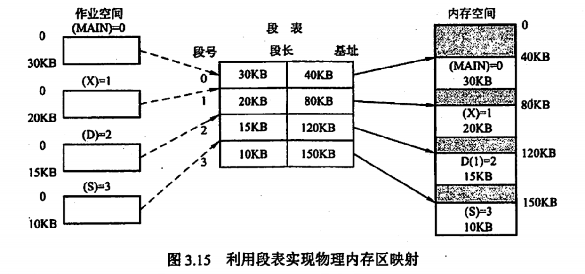
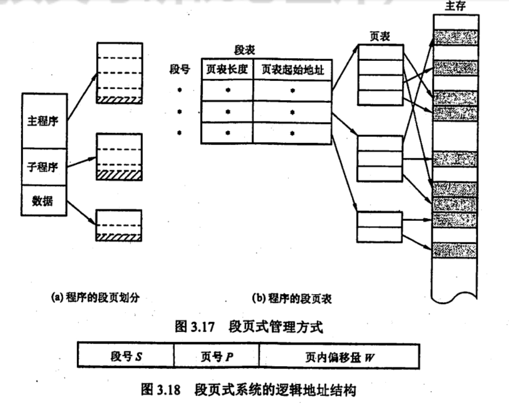
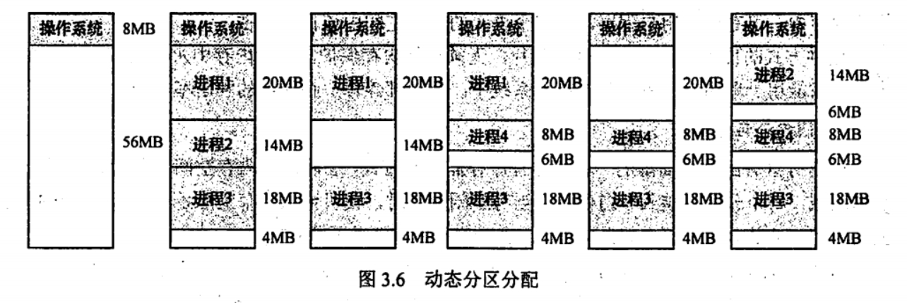
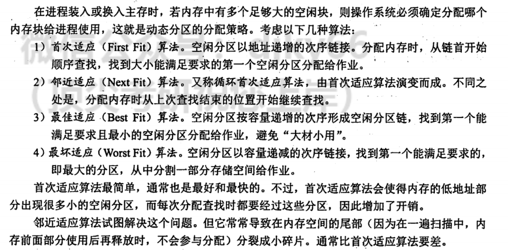

# 让我们来建设真正的地址吧

## 分段式内存

> 老东西快进棺材里吧

就是 AMD64 下的 CS 与 IP

CS 存储的为段选择子，即为**段号**，CS 的缓存中存储的是段表中对应段号的 段起始地址，段长度，段控制位等。

在分段式内存的情况下

$$
\text{物理地址} = \text{段起始地址} + \text{IP}
$$

当然，在访问之前，需要检查一下是否超过了**IP**的值是否超过了段长度，如果超过了，就会触发中断。

  

## 段页式管理

在段页式系统中，作业的逻辑地址分为三部分：段号，页号和页内偏移地址。

  

 

- 注意：在一个进程中，段表只有一个，而页表可能有多个。

## 分段式内存下的内存分配

  

 

  

 

  

 

所以总结为：还是首次适应算法好啊。
