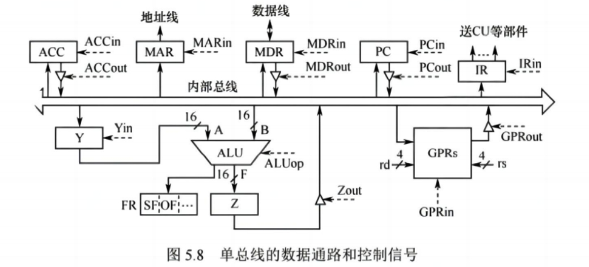
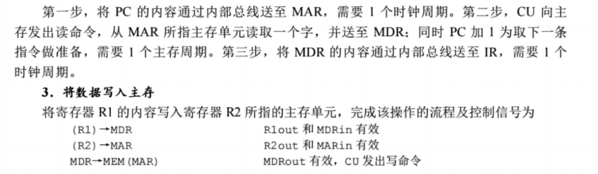

# 草原虽然宽广，道路总是狭窄的

## 一番言いたいこと

事实上，我们无论是哪种 CPU，能看到的都只是**程序地址寄存器**，也就是说，我们无论做什么指令，都要去访问内存，指令都在内存中放着，而不是在 CPU 中。

在考研中，认为一个时钟周期中就可以完成一个微指令，想要提高指令的执行效率，就是需要在一个时钟周期中尽可能多的，在 CPU 内部总线不冲突的条件下把多个微指令塞到一个时钟周期中。

所以我们也可以解释为什么每个汇编指令的执行周期不一样 —— 因为每个指令的微指令消耗的时钟周期不一样。

无论什么指令执行了之后，都会发生的变化是 —— IP 做了加法，指向了下一条被执行的指令。

每条指令要被运行时，CPU 都要考虑的是两样东西 —— PC ( IR ) 和 Flag 寄存器 中的内容，这是 CPU 中最重要的两样东西。

## 数据通路

数据在指令执行过程中所经过的路径，包括路径上的部件，称为数据通路。

组成数据通路的元件主要分为 组合逻辑元件 和 时序逻辑元件 两类。

### 组合逻辑元件（操作元件）与 时序逻辑元件（状态元件）

  

  

## 数据通路的基本结构

### CPU 内部单总线方式

将 ALU 及所有寄存器都连接到一条内部公共总线上，称为单总线结构的数据通路，这种结构比较简单，但数据传输存在较多的冲突现象，性能较低。此总线在 CPU 内部，属于 CPU 内部总线。

由于 CPU 内部总线是采用单总线方式，所以一个时钟周期中只能由一个微指令使用内部总线，但是对于与系统总线交互的微指令，则不用考虑总线冲突问题，可以都塞到一个时钟周期中（系统总线可以有好多，有数据总线，控制总线，地址总线 等等）。

一般考研考的就是这个，CPU 内部的操作都是通过各个运算部件把信息在单总线中进行传递实现的。

  

 

这里的 **in**，**out**，**op** 都连接了谁呢？

😔，就是我们伟大的 **CU**，虽然你看不到它，但实际上它在每个地方。

所谓 _大象无形_ 就是如此吧。

同时这个图中的各种传输的 **控制信号** 和 **数据**，都是抽象的概念，传递的都是抽象的数据类型，可不是代表 $1 bit$ 而是代表着一组数据，一个数字等。

还有注意控制信息传输的硬件实现是靠 **三态门** 来实现的，通过给三态门不同的控制信号来使得信息是否能够流动。

  

### CPU 内部多总线方式

  

### 专用数据通路方式

  

## 数据通路的操作举例

  

 

  

 

## 设置暂存寄存器的原因

  

 

其实也可以说为了让组合逻辑元件能够保留信息，就要使用临时寄存器。

同时为了规避总线冲突，需要将数据传输分成几步走，这就需要使用临时寄存器来保存数据。
