# 往事就像那迷失在远远的雾中的草原

  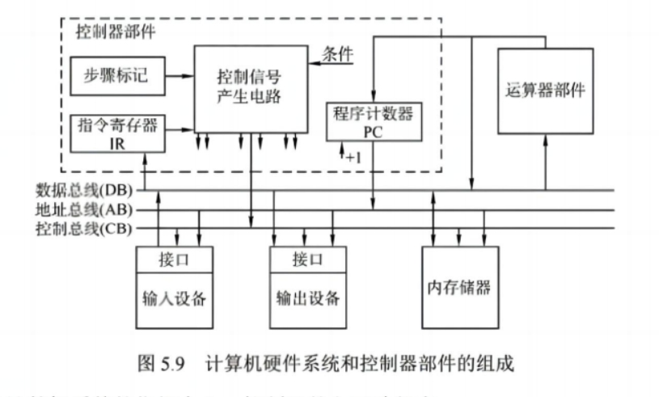

 

计算机整体内部概图，注意 CPU 内部的运算器和控制元件是通过 CPU 内部总线进行通信。

## 控制器 ( CU )

  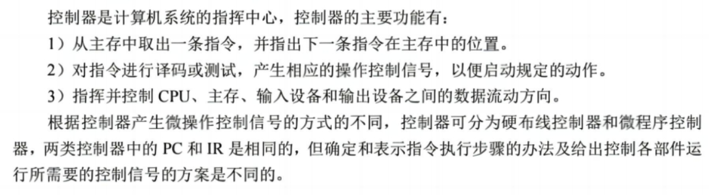

### 硬布线控制器

  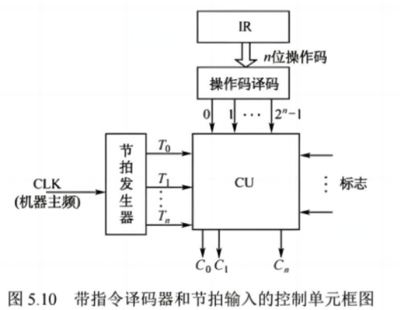

 

这个才是咱们心中的微指令产生方式，就是根据 IR 的译码结果直接产生控制指令。

  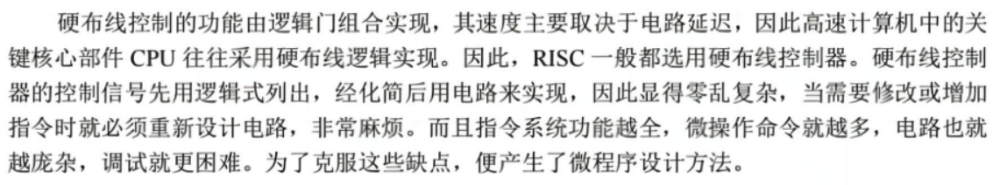

### 微程序控制器

#### 基本思想

  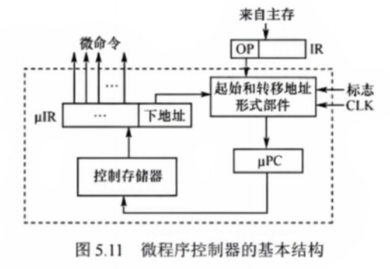

 

一个汇编指令等价于一段微程序，每个微程序又对应着一系列微命令。

> 这里的微命令指的是 CU 对部件发出的具体的控制信号。

IR 中的 OP 字段通过 微地址形成部件 获得该段微程序的第一个微指令的首地址，存放到 uPC 中。

然后根据 uPC 中的地址信息在 控制存储器 中寻找对应的指令，然后存储到 uIR 中，读取 uIR 中的控制字段形成微命令，下地址字段继续放入到 微地址形成部件 中，形成下一个微指令的地址，存放到 uPC 中，重复这个过程，直到这个机器指令执行完为止。

> 所以说其实微程序的概念和正常的程序很想，不同点在于微程序的指令在 CPU 出厂前就已经被写进控制存储器中了，微程序的执行流更多的是一种地址流的概念。

#### 日常黑话

  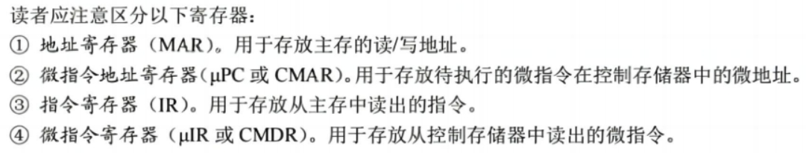

 

其中 _控制存储器_ 一般叫做 **CM**

控制存储器一般直接在 CPU 内部，使用 ROM 存储指令。

#### 微指令的编码方式

##### 直接编码（直接控制）方式

就是微指令不用经过译码器，直接就是微指令内容。

  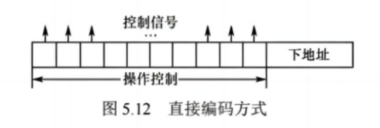

- 优点：简单，直接，执行速度快，操作并行性好

- 缺点：微指令字长过长，n 个微命令就要求微指令的操作字段有 n 位，造成控制存储器容量极大。

##### 字段直接控制的编码方式

  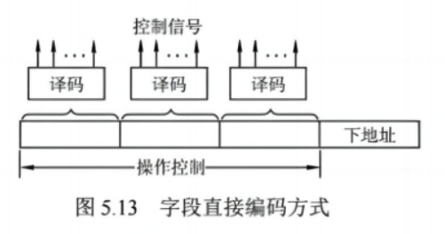

将微指令的操作控制字段分成若干个小字段，把互斥性微命令放在同一字段中，把相容性微命令放在不同字段中。

- 优点：可以缩短微指令字长。
- 缺点：要通过译码电路后才能发出微命令，因此比直接编码方式更慢。

  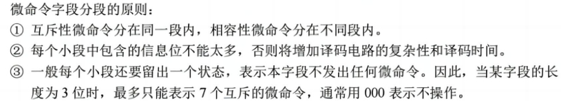

##### 字段间接编码方式

  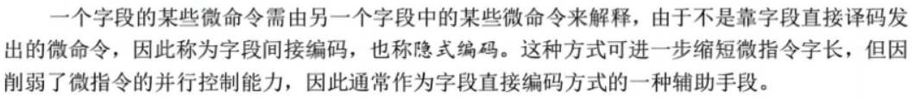

 

  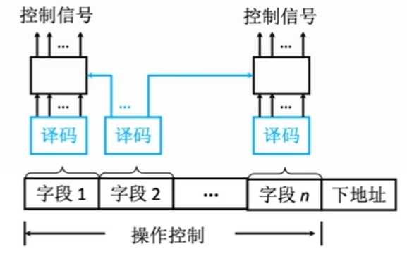

#### 微指令的地址形成方式

  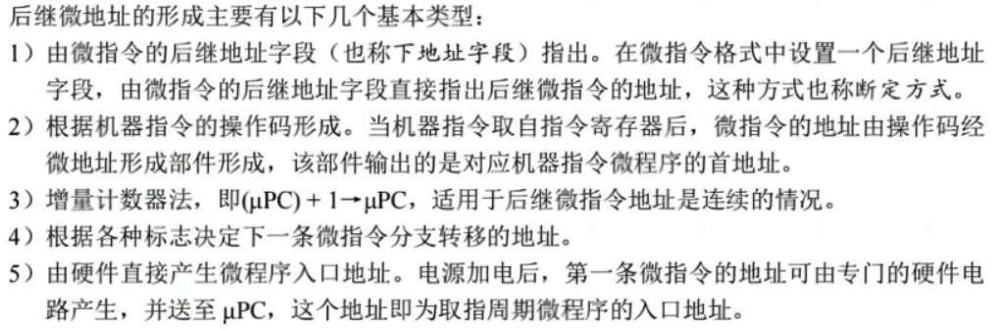

#### 微指令的格式

微指令格式用途微指令的编码方式有关，通常分为水平型和垂直型微指令两种。

##### 水平型微指令

  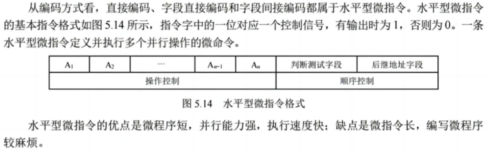

##### 垂直型微指令

类似机器指令操作码的方式，在微指令字中设置微操作码字段，垂直型微指令的基本格式如图所示，一条垂直型微指令通常只能定义并执行一种微命令。

  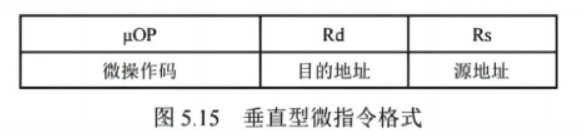

 

  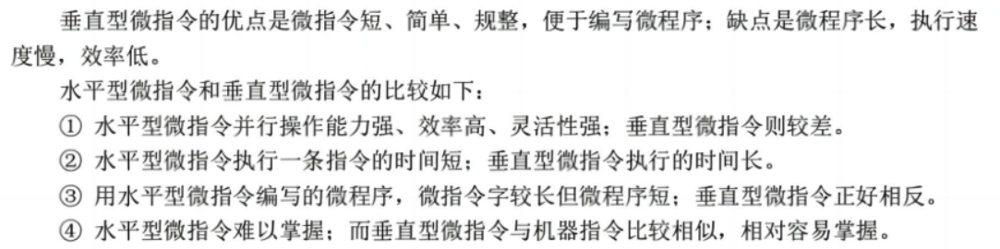

### 硬布线和微程序控制器的特点

  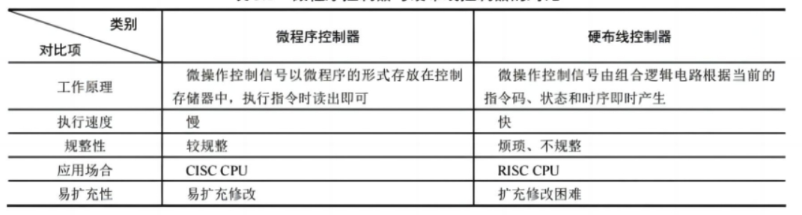

