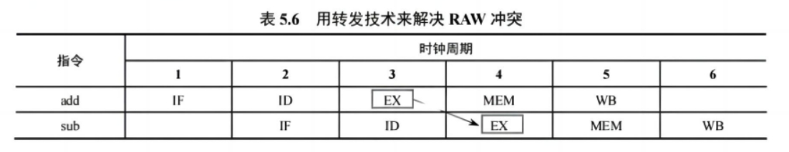

# 种风的人，收获的是风暴

不过考研只考顺序执行，不考乱序执行。

> 考乱序执行只能当场暴毙力 ~

## 处理机的并行性

### 流水线

时间上的并行技术

只有大量连续任务不断输入流水线，才能充分发挥流水线的性能。

### 超标量

空间上的并行技术，一个时钟周期内同时运行多条指令。

### 超标量流水线技术

一个时钟周期中发射多条指令，同时结合流水线技术。

<div align="center">
  
</div>

### 超长指令字技术

<div align="center">
  
</div>

### 超流水线技术

<div align="center">
  
</div>

## 五级流水线

> 这既是考研目前的考试标准，同时也是现在 RISC-V 所采取的基本流水线方法。

1. 取指 (IF)：从指令寄存器或 cache 中取指令。
2. 译码/ 读寄存器 (ID)：操作控制器对指令进行译码，同时从存储器中读取操作数。（也就是说这个这个时候，指令所需要的数值就从寄存器中读取了）
3. 执行/ 计算地址 (EX): 执行运算操作或计算地址。 （比如 **add** 指令进行运算，或者是间接寻址 **[rax + 0x18]**，从第二步中获得的寄存器值加上指令中的偏移量获得真正的地址信息）
4. 访存 (MEM): 对存储器进行读/ 写操作。（对于 **add** 这样的根本不涉及访存的操作，这一步流水线就是单纯的空操作）
5. 写回 (WB): 将指令执行结果写回存储器。（对于 **store** 这样的不写回寄存器的操作，这一步流水线也是单纯的空操作，且不能跳过去，需要进行）

<br/>

<div align="center">
  
</div>

<br/>

在理想情况下，每个时钟周期都有一个指令进入流水线，每个时钟周期都有一条指令完成，每条指令的时钟周期数 （ 即 CPI ）都为 1 。

## 流水线对指令集的要求

<div align="center">
  
</div>

## 流水线的逻辑结构

每个流水段后面都要添加一个**流水段寄存器**，用于锁存本段处理完的所有数据，以保证本段的执行结果能在下一个时钟周期给下一流水线使用。

各种存储器和数据寄存器均采用统一时钟**CLK**进行同步，每来一个时钟，各段处理完的数据都将锁存到段尾的流水线寄存器中，作为后段的输入。

同时，当前段也会收到前段通过流水段寄存器传递过来的数据。

<div align="center">
  
</div>

<br/>

由于**流水段寄存器**的机制，_I4_ 的**IF**指令只能在第七个时钟周期执行，而不能在第四个时钟周期执行。

因为如果*I4* 的**IF**指令在第四个时钟周期运行，就会导致 CPU 的 **IF寄存器** 被覆盖，到第八个时钟周期时，CPU 执行*I3*的**EX**阶段时执行的却是**I4**的**IF**内容，造成错误。

<div align="center">
  
</div>

## 冒险与阻塞

在指令流水线中，可能会遇到一些情况使得后续指令无法正确执行而引起流水线阻塞，这种现象称为**流水线冒险**，根据导致冒险的原因不同分为**结构冒险**，**数据冒险**，和**控制冒险**。

### 结构冒险

由不同指令在同一时刻争用同一功能部件而形成的冲突，也称**资源冲突**，即由硬件资源竞争造成的冲突。

<div align="center">
  
</div>

<br/>

比如这里的 **IF** 和 **MEM**，由于都需要使用数据总线，就会导致**结构冒险**，需要使用停顿来错开使用。

<div align="center">
  
</div>

### 数据冒险

数据冒险也称**数据相关**。

引起数据冒险的原因是，后面指令用到前面指令的结果时，前面指令的结构还没有产生。

#### 解决数据冲突的方法

##### 延迟执行

说白了就是加停顿

```c
add R1, R2, R3;
sub R4, R1, R5;
```

<div align="center">
  
</div>

**sub**指令在**译码**时候，需要获得 _R1_ 的数据，但 _R1_ 需要在**写回**(WB) 才能确定，所以需要延迟执行。

##### 转发（旁路）技术

设计一个额外的数据通路，将上面流水线过程中的步骤直接转发到下一个流水线中，消灭数据冲突情况。

```c
add R1, R2, R3;
sub R4, R1, R5;
```

按照我们理论上的想象，应该是 **add** 的**EX**结果转发给**sub**的**ID**过程，但实际上是直接转发给**sub**的**EX**过程就行。

这样最直接，还不用给**sub**一个延迟来进行转发。

> 哎，规矩

<div align="center">
  
</div>

<br/>

```c
load R2, 12(R1);
add R4, R3, R2;
```

所以说转发都是转发给第二层流水线的**EX**阶段。

<div align="center">
  
</div>

### 控制冒险

> 哪有什么控制，只不过是 PC 的任务罢了。

目前只有一种情况会发生控制冒险，就是在条件跳转，分支指令的时候会发生。

```c
loop: add R1, R1, 1;
bne R1, R2, loop;
```

<br/>

<div align="center">
  
</div>

<br/>

<div align="center">
  
</div>

### 大革

**cache**缺失的处理也会引起流水线阻塞。

> 你以为敌人在外面，实际上敌人就是你，就是我，就是我们大家。

### 流水线计算公式

设 **k** 为流水线的段数，$\Delta{t}$为时钟周期，**n**为执行的指令数。

执行的时钟周期数量 $x$ 为：

$$
x = (k + n - 1) \cdot \Delta{t}
$$

当 $n \to \infty$ 时，流水线可以达到一个$\Delta{t}$执行完成一条指令。
当 $n \to \infty$ 时，使用流水线可以加速为原来执行效率的**k**倍。
