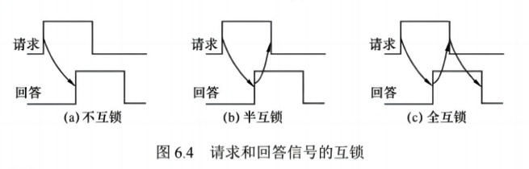

# 总线の春秋

## 1.总线标准（已经寄了

## 2.串行与并行

现在都是串行，没有并行，串行比并行快，串行是一位一位传输数据。

## 3.全双工与半双工

全双工总线在计算传输速率时要乘以2，也要把对面传输的数据也算上。

（不然怎显得我*全双工特色总线主义*的伟大）

## 4.总线事务

从请求总线到完成总线使用的操作序列称为总线事务，它是在一个总线周期中发生的一系列活动，典型的总线事务包括请求操作，仲裁操作，地址传输，数据传输和总线释放。

1. 请求阶段。主设备（CPU或DMA）发出总线传输请求，并且获得总线控制权。
2. 仲裁阶段。总线仲裁机构决定将下一个传输周期的总线使用权授予某个申请者。
3. 寻址阶段。主设备通过总线给出要访问的从设备地址及有关命令，启动从模块。
4. 传输阶段。主模块和从模块进行数据交换，可单向或双向进行数据传送。
5. 释放阶段。主模块的有关信息均从系统总线上撤除，让出总线使用权。

> 如果不是猝发传送的话，一次总线事务只能传一个字长的数据。

## 5.突发（猝发）传送

突发（猝发）传输方式能够进行连续成组数据的传送，其寻址阶段发送的是连续数据单元的首地址，在传输阶段传送多个连续单元的数据，在传输阶段传送多个连续单元的数据，不释放总线，直到一组数据全部传送完毕后，再释放总线。

简单来说就是, 或者说根本就是——

```c
mov rdi, rax
mov rsi, rcx
mov ecx, 0x28
rep movsb
```

## 6.总线异步定时方式(总线异步传输)

### 不互锁方式

传输双方都没有握手动作，请求一段时间后没有回应就撤销请求信号，回答一段时间后没有回应就撤销回复信号。

> 所谓的信号其实指的就是单纯的高低电平而已。

### 半互锁方式

传输双方一个以握手方式通信，一个不以握手方式通信。

谁请求通信谁就要一直等待回复信号。

### 全互锁方式

通信双方都以握手方式通信，而且和TCP不同，没有收到响应就不会撤销等待状态。

<div align="center">
  
</div>

## 6.5 异步串行通信方式的特点

### 半同步定时方式

为什么叫**半同步方式**，因为它仍然保留了 _同步定时功能_，地址，命令，数据信号的发送时间都是按照同步时钟进行。

至于说哪里异步，就是多安了一个**Wait 信号线**

半同步设备每隔一段同步时钟后就会采样一下**Wait**信号。

其实就是自己当**Poller**和**Waker**力。

### 分离式定时方式

> 这才是真正的异步
> 异步
> 异步
> 异步

A 获取总线后，把数据和指令传送后就立刻释放总线。

B 在收到数据后，如果也想给 A 传送数据，也会申请总线并获取后传输数据，传输完毕后立刻释放总线，不浪费时间。

- 优点： 在不传输数据时释放总线，使得总线可接受其他设备的请求，不存在空闲等待时间。
- 缺点： 控制复杂，开销大。

## 7.南北桥(悲

> 四九年，我们在一座桥上，五零年，我在北桥，他在南桥。

总线和总线之间需要通过**桥**（即桥芯片）进行连接。

其中连接CPU总线和PCI总线的是**北桥芯片**，连接PCI总线和外部设备总线的叫做**南桥芯片**。
