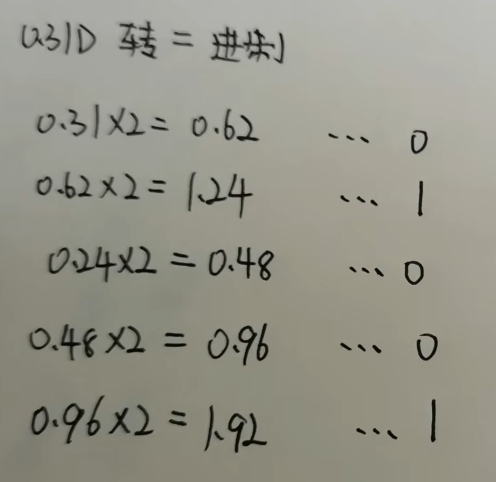
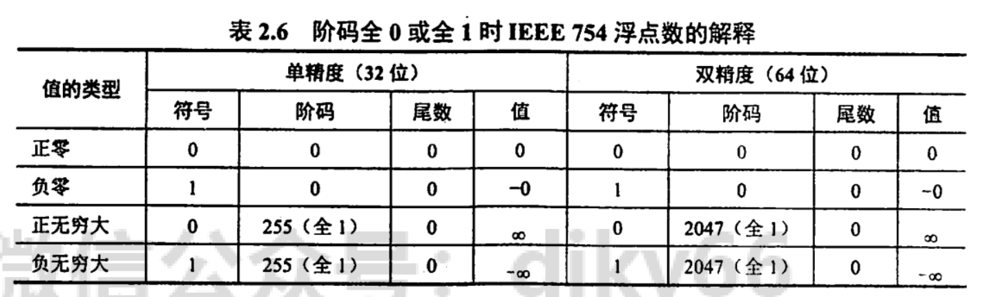
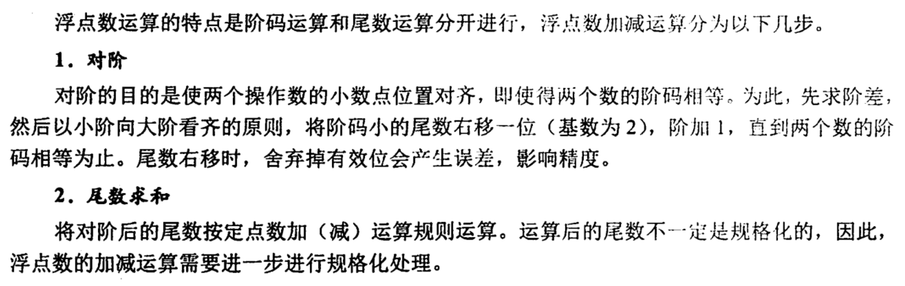
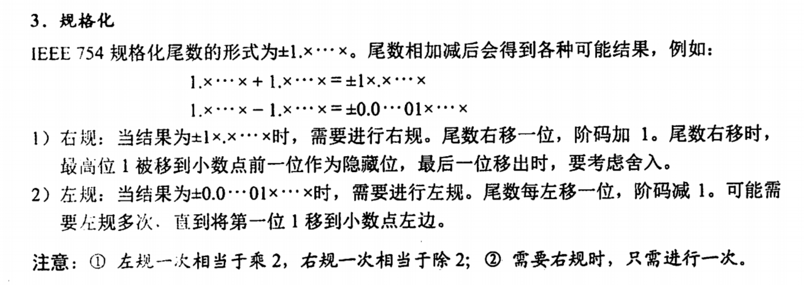
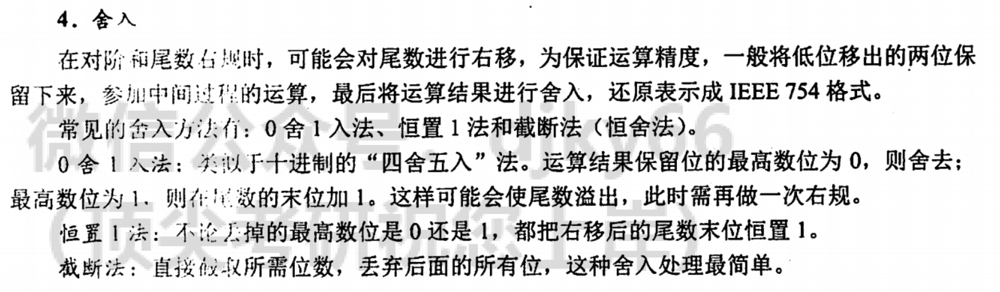
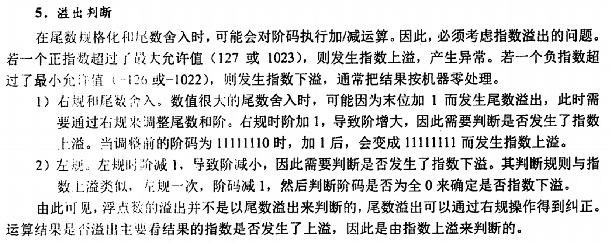

# 浮在空中，就可以躲避地面上的苦痛了吗？

## 十进制小数转二进制小数

- 这不会不行啊，顶不住啊(悲
<div align="center">
  
</div>

## IEEE-754

$$
V = (-1)^s \times M \times 2^E
$$

- s符号位：表示数值的正负。
- M尾数：表示数值的有效数字(小数)。
- E指数：决定小数点的位置。

在 IEEE-754 标准中，定义了两种精度的浮点数，分别是单精度浮点数（32位）和双精度浮点数（64位）

## f32

- 1位符号位 s
- 8位指数 exp
- 23位尾数 frac

<div align="center">

</div>

## f64

- 1位符号位s
- 11位指数exp
- 52位尾数

<div align="center">
  
</div>

## 浮点三类

1. 规格化
2. 非规格化
3. 特殊的

其中第三类“特殊的”又可以根据`frac`分成两类：

1. 无穷大
2. NaN

<div align="center">
  
</div>

## 无穷大

如果指数全为1，但是尾数全为零, 便是无穷大。

如果符号位是0，为正无穷大。

如果符号位是1，为负无穷大。

## NAN

如果指数全为`1`，但是尾数不全为0，则为*NaN*。

## 规格化值

- **指数部分**：不全为0且不全为1。
- **尾数部分**：可以是任意值。
- **作用**：用于表示大多数非零数值。

在规格化值中：

- $E = e - \text{bias}$
- $M = 1 +f$

其中`e`即为`exp`，`bias` 是偏置量，它的值为$2^{k-1} - 1$，其中`k`为 `exp`的位数，故:

- 在单精度中，$\text{bias} = 2^{8 - 1} - 1 = 2^{7} - 1 = 128 - 1 = 127$
- 在双精度中，$\text{bias} = 2^{11 -1} - 1 = 2^{10} - 1 = 1024 - 1 = 1023$

其中`f`为`frac`表示的数，范围$0 \le f < 1$

所以一个规格化的数，具体可以表示为：$V = (-1)^{\text{sign}} \times 1.\text{frac} \times 2^{exp - bias}$

## 非规格化的值

- **指数部分**: 全为0。
- **尾数部分**：可以是任意值
- **作用**:
  - 提供表示数值 0 的方法。因为规格化中$M\ge1$，所以无法表示 0。
  - 用于表示非常接近于 0 的数值，这些数值太小，无法用规格化格式表示。它们填补了 0 和最小规格化正数之间的间隙，提供了渐近于 0的连续表示，防止了所谓的“下溢”。

在非规格化值中：

- $E = 1 - \text{bias}$
- $M = f$

所以一个规格化数，具体可以表示为：$V = (-1)^{\text{sign}} \times 0.\text{frac} \times 2^{(1-\text{bias})}$

## 浮点数的加减运算

<div align="center">
  
  
  
  
</div>

在浮点运算中，运算结果超出尾数表示范围却不一定溢出，只有规格化后阶码超出所能表示的范围时，才发生溢出。

## Rust代码演示

```rust
#[cfg(test)]
#[allow(clippy::unusual_byte_groupings)]
mod tests {
    use std::ops::Neg;

    #[test]
    fn subnormal_number() {
        assert_eq!(
            0b_0_00000000_10000000000000000000000,
            (f32::MIN_POSITIVE / 2.0).to_bits()
        );
    }

    #[test]
    fn max_number() {
        assert_eq!(0b_0_11111110_11111111111111111111111, f32::MAX.to_bits());
    }

    #[test]
    fn min_positive_num() {
        assert_eq!(
            0b_0_00000001_00000000000000000000000,
            f32::MIN_POSITIVE.to_bits()
        )
    }

    #[test]
    fn min_negative_num() {
        assert_eq!(
            0b_1_00000001_00000000000000000000000,
            f32::MIN_POSITIVE.neg().to_bits()
        );
    }

    #[test]
    fn min_number() {
        assert_eq!(0b_1_11111110_11111111111111111111111, f32::MIN.to_bits());
    }

    #[test]
    fn non_number() {
        assert_eq!(0b_0_11111111_10000000000000000000000, f32::NAN.to_bits());
    }

    #[test]
    fn positive_infinity() {
        assert_eq!(
            0b_0_11111111_00000000000000000000000,
            f32::INFINITY.to_bits()
        );
    }

    #[test]
    fn negative_infinity() {
        assert_eq!(
            0b_1_11111111_00000000000000000000000,
            f32::NEG_INFINITY.to_bits()
        );
    }
}
```
